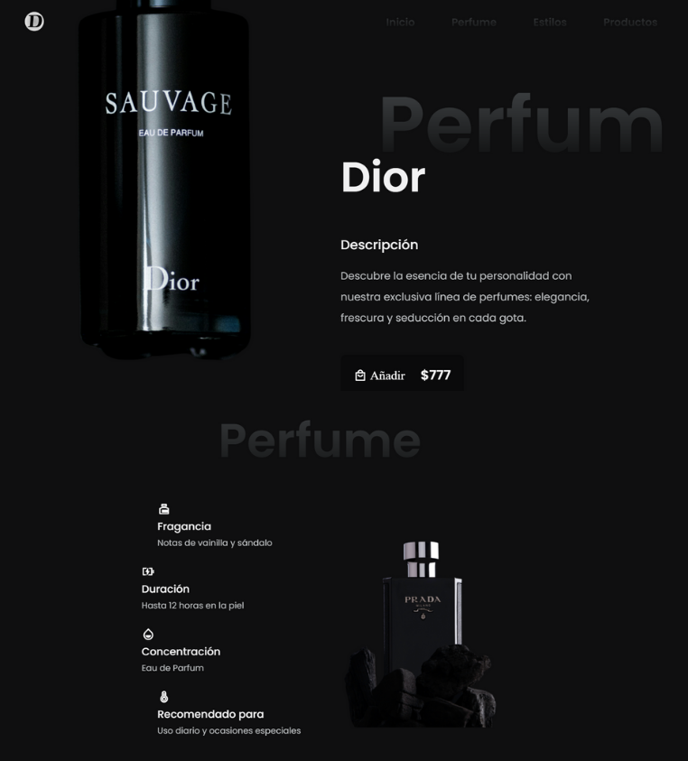

# LeParfum - Landing Page de Perfumes

## Descripción
Esta es una landing page diseñada para la venta de perfumes. La página está optimizada para atraer clientes mediante una estructura clara, imágenes llamativas y llamadas a la acción estratégicas. Incluye una sección destacada para un perfume principal, promociones con descuentos y un formulario de suscripción a un boletín de novedades.

## Características
- **Diseño elegante y moderno**
- **Sección destacada** con un perfume principal y detalles clave
- **Promociones y descuentos** en productos seleccionados
- **Footer con enlaces útiles** y redes sociales

## Tecnologías Utilizadas
- **HTML5** para la estructura de la página
- **CSS3** para el diseño y estilos
- **JavaScript** para la interactividad

# Vista previa

